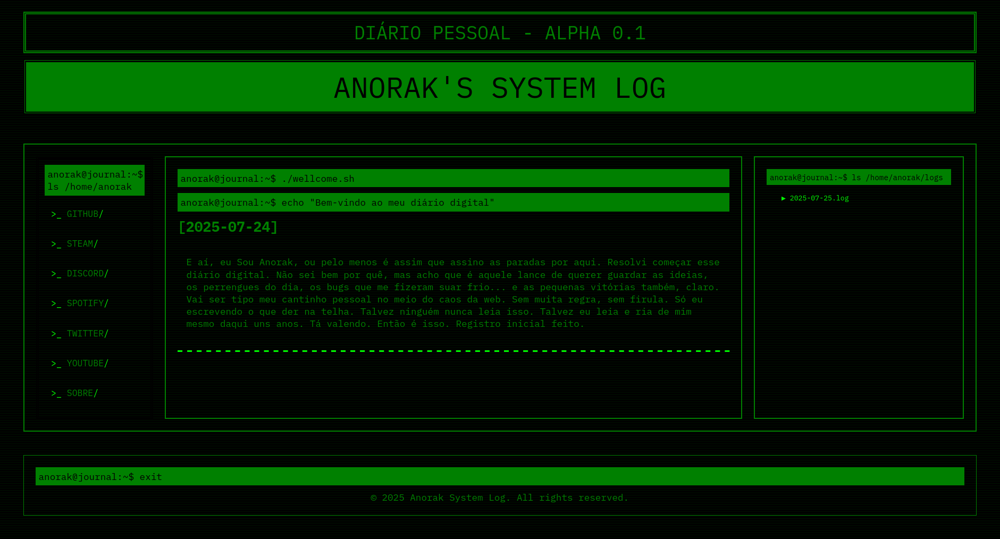
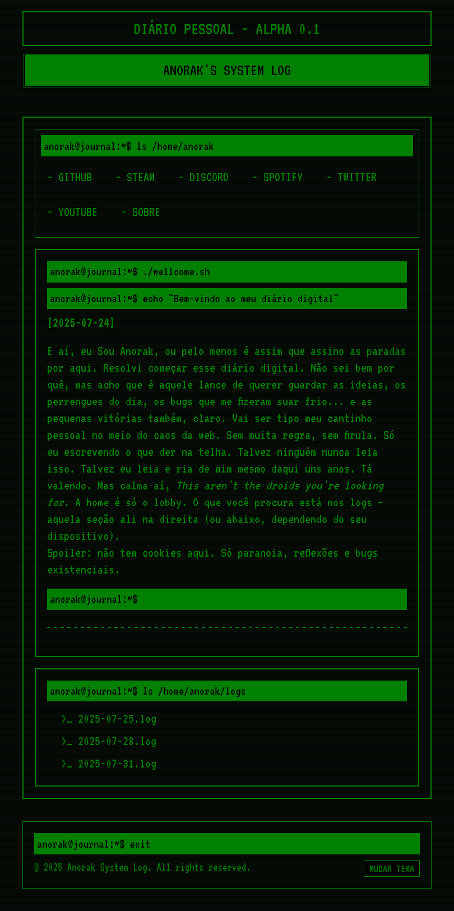
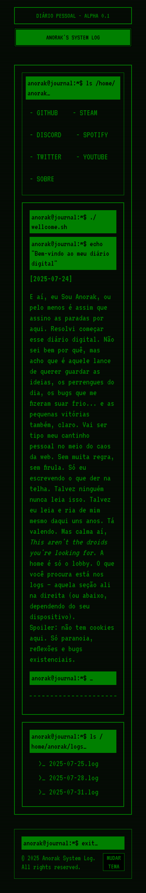
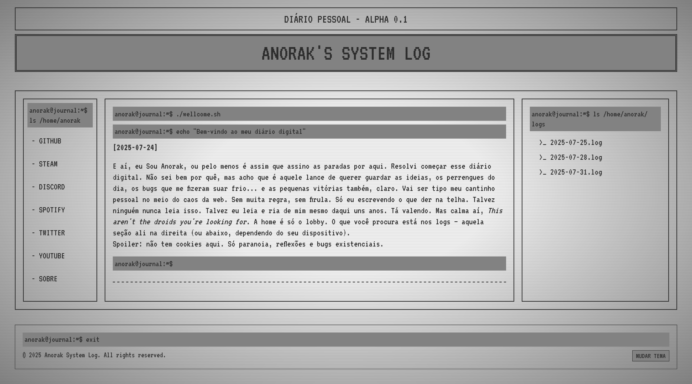
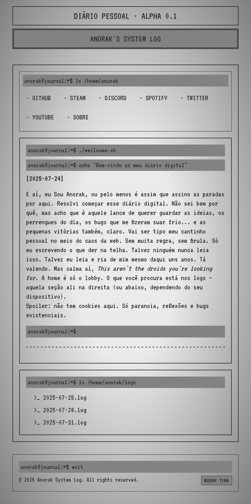
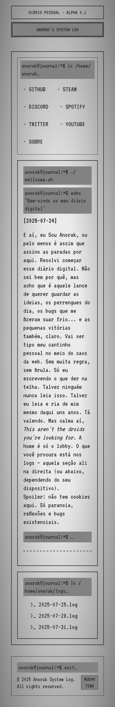

# Anorak's System Log

🧠 Meu diário digital estilo terminal retrô — agora com carregamento dinâmico de posts, boot sequence e efeitos CRT autênticos!

[](https://github.com/SirSouza/anorak-system-log)
[](LICENSE)

## 🎯 Sobre o Projeto

Um espaço pessoal onde compartilho ideias, bugs, vitórias e devlogs no estilo old school. Inspirado em terminais Unix/DOS dos anos 80-90, com efeitos visuais autênticos de monitores CRT.

## ✨ Novidades da Versão 1.0

### 🔥 Mudanças Principais
- **Sistema de carregamento dinâmico** - Posts carregados via JavaScript, sem duplicação de código
- **Boot sequence** - Animação de inicialização ao carregar a página
- **Efeitos CRT autênticos** - Scanlines, flickering e glow effect
- **ASCII Art logo** - Logo em arte ASCII no header
- **Navegação melhorada** - Link HOME para voltar à página inicial
- **Arquitetura modular** - Cada post é um arquivo HTML independente

### 🎨 Melhorias Visuais
- Efeito de tela CRT com scanlines animadas
- Glow effect fosforescente no texto
- Animação de scanning no header
- Glitch effects nos elementos interativos
- Tema claro/escuro com transições suaves

### 🏗️ Melhorias Técnicas
- Sistema de variáveis CSS para fácil customização
- Carregamento assíncrono de posts com `fetch()`
- Geração automática de links na sidebar
- Código modular e fácil de manter
- Sem dependências externas (vanilla JS)

## 📸 Preview

### Desktop


### iPad


### Mobile


## Light Mode Preview

### Desktop


### iPad


### Mobile


## 🚀 Acesse o site

🔗 [sirsouza.github.io/anorak-system-log](https://sirsouza.github.io/anorak-system-log)

## 🛠️ Tecnologias

- **HTML5** - Estrutura semântica
- **CSS3** - Estilização com variáveis CSS e animações
- **JavaScript (Vanilla)** - Carregamento dinâmico e interatividade
- **Fontes**: 
  - [VT323](https://fonts.google.com/specimen/VT323) - Estilo terminal monoespaçado
  - [IBM Plex Mono](https://fonts.google.com/specimen/IBM+Plex+Mono) - Alternativa moderna

## 📂 Estrutura do Projeto
```
anorak-system-log/
├── index.html              # Página principal (shell)
├── logs/                   # Posts individuais
│   ├── log-2025-07-25.html
│   ├── log-2025-07-28.html
│   └── ...
├── assets/
│   ├── style.css          # Estilos com variáveis CSS
│   ├── lightmode.js       # Toggle de tema claro/escuro
│   ├── entries.js         # Carregamento dinâmico de posts
│   ├── favicon.ico
│   └── *.png              # Screenshots
└── README.md
```

## 🎮 Como Adicionar um Novo Post

1. **Crie o arquivo do post** em `/logs/`:
```html
<!-- logs/log-2025-01-15.html -->
<article class="entry">
    <div class="prompt">anorak@journal:~$ cat 2025-01-15.log</div>
    <div class="entry-date"><h2>[2025-01-15]</h2></div>
    <div class="entry-content">
        <p>Conteúdo do seu post aqui...</p>
    </div>
</article>
```

2. **Adicione a data** no array de entries (`assets/entries.js`):
```javascript
const entries = [
    '2025-01-15',  // ← Adicione aqui
    '2025-12-03',
    '2025-08-26',
    // ...
];
```

3. **Pronto!** O link aparece automaticamente na sidebar 🎉

## 🎨 Customização

### Alterar Cores do Tema

Edite as variáveis CSS em `assets/style.css`:
```css
:root {
  --text-color-base: #00ff00;  /* Verde neon */
  --bg-color: #000;            /* Fundo preto */
  /* ... outras variáveis */
}
```

### Desabilitar Efeitos CRT

Remova ou comente o elemento no HTML:
```html
<!-- <div class="crt-overlay"></div> -->
```

## 🐛 Problemas Conhecidos

- Boot sequence roda a cada reload (feature, não bug! 😄)

## 📝 Changelog

### v1.0.0 (Janeiro 2026)
- 🎉 Lançamento da versão 1.0
- ✨ Sistema de carregamento dinâmico de posts
- 🖥️ Efeitos CRT autênticos
- 🎨 Boot sequence animada
- 🔄 Navegação melhorada com link HOME
- 📱 Totalmente responsivo

### v0.2 (Agosto 2025)
- ➕ Adicionado tema claro/escuro
- 🎨 Melhorias visuais gerais

### v0.1 (Julho 2025)
- 🚀 Primeira versão do diário
- 📝 Posts estáticos em HTML

## 📄 Licença

Este projeto está sob a licença MIT. Veja o arquivo [LICENSE](LICENSE) para mais detalhes.

## 🤝 Contribuições

Sugestões e melhorias são bem-vindas! Sinta-se livre para abrir uma issue ou pull request.

## 📧 Contato

- GitHub: [@SirSouza](https://github.com/SirSouza)
- Discord: [Join my server](https://discord.gg/xzXcZBFqSd)

---

<p align="center">
  Feito com ❤️ e muita nostalgia dos anos 80-90
</p>