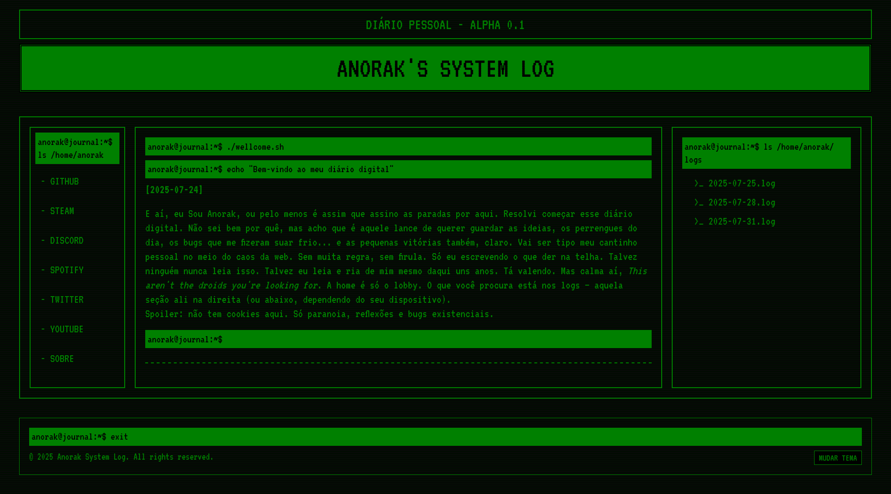

# Anorak's System Log

🧠 Meu diário digital estilo terminal retrô — feito com HTML + CSS puro. Um espaço pessoal onde compartilho ideias, bugs, vitórias e devlogs no estilo old school.

## 📸 Preview

### Desktop

### iPad

### Mobile

## 🚀 Acesse o site
🔗 [sirsouza.github.io/anorak-system-log](https://sirsouza.github.io/anorak-system-log)

## 🛠️ Tecnologias
- HTML5
- CSS3
- Fonte: [VT323](https://fonts.google.com/specimen/VT323) e [IBM Plex Mono](https://fonts.google.com/specimen/IBM+Plex+Mono)

## 📂 Estrutura do projeto
anorak-system-log/
├── index.html
├── logs/
│ └── log-2025-07-25.html
├── assets/
│ ├── style.css
│ ├── preview.png
│ ├── ipad-preview.png
│ └── mobile-preview.png
│ └── favicon.ico
